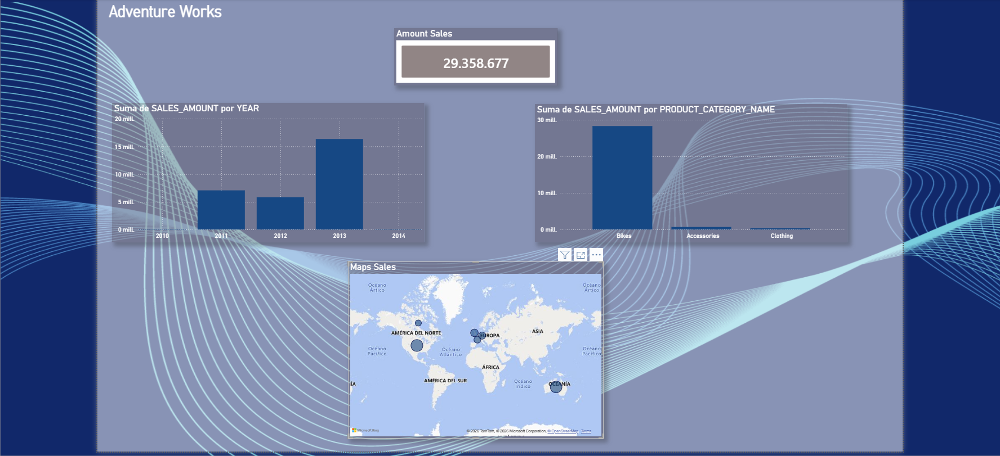

# 🚲 Adventure Works - Sales Dashboard

## 📋 Descripción
Análisis de ventas de Adventure Works usando Python para extracción 
y transformación de datos, y Power BI para visualización.

## 🛠️ Tecnologías utilizadas
- Python (pyodbc, pandas)
- SQL Server (AdventureWorksDW2022)
- Power BI Desktop

## 📊 Dashboard

## 🔄 ¿Cómo funciona?
1. Python se conecta a SQL Server local
2. Extrae 60.398 registros de ventas con múltiples JOINs
3. Transforma y limpia los datos con Pandas
4. Exporta a CSV para Power BI

## 📈 Insights encontrados
- 2012 fue el año de mayor facturación
- Bikes representa la categoría con mayor volumen de ventas
<<<<<<< HEAD
- Total de ventas: $29.358.677
=======
- Total de ventas: $29.358.677
>>>>>>> 6bbe56e9c7799624f87c5ff12d6770ea456f68ff
